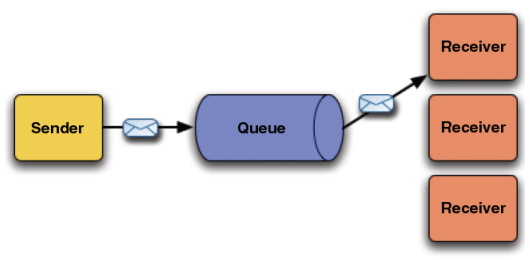
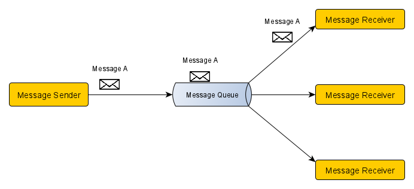
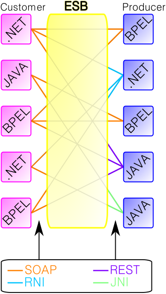

# Messaging Queue

## [Messaging Queue (MQ)](#messaging-queue-mq-1)

- What is a message?
- Communication within and outside of a larger application
- Message Broker
- Components and Types of MQ
- Role of the Messaging Queue

## [Popular Tools](#popular-tools-1)

- RabbitMQ
- IBM MQ

## [Enterprise Service Bus](#enterprise-service-bus-esb)

- Introduction
- Features
- Limitations
- Tools

## [Reference](#reference-1)

## Messaging Queue (MQ)

### What is a message?

- In our context, a message is a piece of useful information/data in communication where the involved parties **cannot** communicate directly.
- Emails, SMS, voice mails, etc. are some examples that we use in our daily lives.
- We need messages to ensure the effective transfer of information/data between involved parties, so they are updated and can work accordingly.

### **Communication within and outside of a larger application**

- In our modern, fast-growing technological world, we have created large, complex applications to serve our interests and requirements.
- These complex applications are huge, with a lot of components that carry out different tasks assigned or programmed to them.
- Just like humans, these components need to communicate within, as well as outside the application.
- These messages help each component to communicate useful information for their functioning, the completion of a task, and the purpose of the larger application.

### **Message Broker**

- As we understood that components require effective communication with one another, a separate system is required to handle all the messages, manage them, and help other components to access them.
- This is where message brokers come in; it is a separate component that provides the messaging service among other components.
- It performs multiple functions, but one of its crucial sub-structures is **message queue** which ensures the persistence and core functionalities of messaging.

### **Components and Types of MQ**

- There are mainly three components involved.
- Producer : One who initiates and sends the message.
- Message Broker and message queue: Manages the messages.
- Consumer : Accesses or receives the message.
- When a producer initiates or sends a message, it goes to the message broker, which persists in the message queue. Later, the consumer can access the message.
- There are mainly two types of MQ:

1. Point-to-Point MQ
2. Publish-Subscribe MQ

- **Point-to-Point MQ**
- As the name suggests, it is used to message from one single point to another single point. Here, the producer sends the message, which is stored in MQ till the consumer retrieves it.

- **Publish-Subscribe MQ**
- When users are subscribed to a producer's messages, whenever the producer publishes a new message, it is routed to all the subscribers. These consumers can then access the message from MQ.

- There are a lot of complexities involved, but this is a general overview of the message flow.

### **Role of Messaging Queue**

- A data structure that stores and manages the messages until consumed by the message consumers. It acts as a buffer, or intermediary, between producers and consumers.
- The messaging queue helps in achieving the following functionality:
- **Asynchronous Communication** : Both the message sender and message receiver need not be present at the exact same time.
- **Loose coupling**: Reduces the strict interdependency among different components, i.e., disruption in one component won't necessarily disrupt other components.
- **Scalability**: Helps in handling large traffic of messages, and can be improved by adding more technological resources.
- **Workflow Management** : Manages the complex communication among the components, improving the efficacy of the application.

## Popular Tools

- To implement the functionalities mentioned above in our applications, we need tools and software that can be integrated to achieve efficient messaging among components. Some of the popular tools are described below:

### RabbitMQ

- RabbitMQ is an open-source message broker software that uses AMQP to transmit and transfer data.
- **AMQP** Advanced Message Queuing Protocol : It is an open standard for passing business messages between applications or organizations. It connects systems, organizations, and components with the information they need and reliably transmit.
- Main features:
- Lightweight : Easy to install on local machines and in the cloud
- Multi-Platform : Provides client APIs for many popular languages like Java, Python, JavaScript, Ruby, etc.
- Feature Rich : Offers multiple advanced features for both clients and brokers.

### IBM MQ

- It is a family of message-oriented middleware products. It was originally launched as MQSeries, which was further renamed to WebSphere MQ and finally renamed to IBM MQ.
- Main features:
- Secure : Provides message-level security and identity access management.
- Reliable : Never loses messages.
- Multi-style messaging : Connect diverse systems requiring different message styles.

## Enterprise Service Bus (ESB)

### Introduction

- It is an architectural pattern whereby a centralized software component performs integrations between applications.

- All customer services communicate in the same way with the ESB: the ESB translates a message to the correct message type and sends the message to the correct consumer service.

- An overview of ESB is, that it simplifies the messaging, communication, and other integration between different applications, and their components.
- It plays a crucial role in performing operations like data transformation, protocol conversion, and message routing. Applications pass relevant data to the ESB, and it converts and forwards the data to other applications that need it.

### Features

- Improved application integration : Helps in integrating different applications of different technologies.
- Increases Developer Efficiency : Developers can build applications faster by using prebuilt communication services provided by the ESB.
- Easy Monitoring : Organizations can monitor the flow of data and services across different applications and quickly identify and resolve any issues that may arise.

### Limitations

- Complexity : It requires special technical knowledge to implement and maintain an ESB, which makes it complex and expensive.
- Scalability : It introduces additional latency in the communication due to added layers of abstraction and processing. As the application becomes larger and more complex, the ESB becomes a bottleneck and impacts performance.

### Tools

- Applications require tools to implement ESB, some of the popular tools are:
- Mule ESB
- IBM Websphere ESB
- Oracle ESB

## Reference

- [Messaging-Queue-GFG](https://www.geeksforgeeks.org/message-queues-system-design/)
- [AWS-message-queue](https://aws.amazon.com/message-queue/)
- [RabbitMQ-tutorialspoint](https://www.tutorialspoint.com/rabbitmq/rabbitmq_features.htm)
- [IBM-MQ](https://www.ibm.com/products/mq)
- [AWS-ESB](https://aws.amazon.com/what-is/enterprise-service-bus/)
- [ESB-wikipedia](https://en.wikipedia.org/wiki/Enterprise_service_bus)
